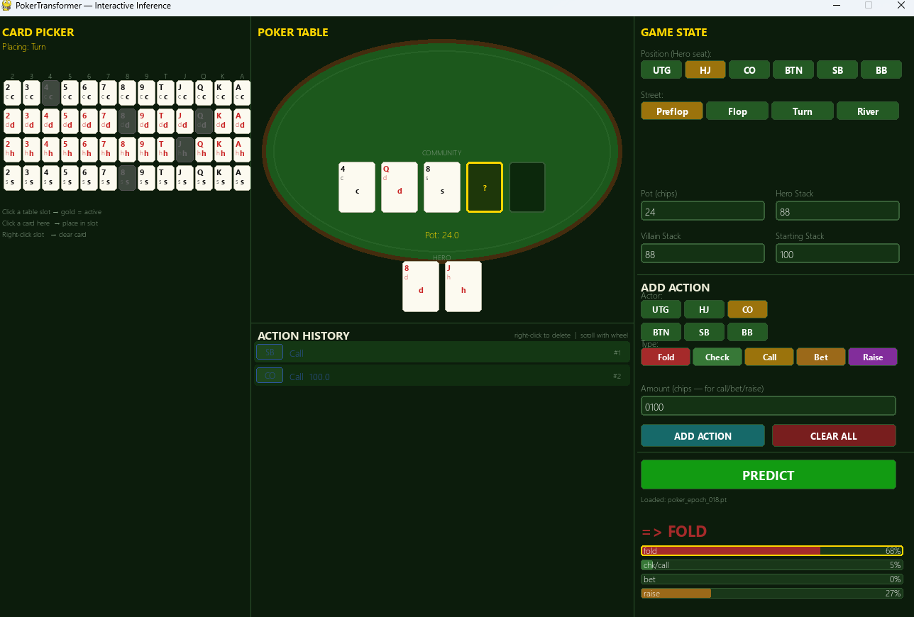

# POKERBOT

A trained Transformer that plays 6-max No Limit Texas Hold'em.
Describe any hand and it tells you what to do: **fold, check/call, bet, or raise** — plus a bet size.

---


## Setup

```bash
pip install torch pygame
```

## Run

```bash
python -X utf8 poker_ui.py
```

> Windows requires `-X utf8` to avoid encoding errors.

---

## How to use

1. **Click a card slot** on the table — it glows gold
2. **Click a card** in the left grid to place it there
3. **Right-click a slot** to clear it
4. Set **Position** and **Street** on the right panel
5. Fill in **Pot**, **Hero Stack**, **Villain Stack**
6. Add past actions with the action editor
7. Click **PREDICT**

The model outputs action probabilities + a bet size recommendation.

---

## Layout

```
+-----------------+----------------------+----------------------+
|  CARD PICKER    |    POKER TABLE       |  CONTROLS            |
|                 |                      |                      |
|  13x4 grid      |  community cards     |  Position / Street   |
|  click to place |  hero cards          |  Pot / Stacks        |
|                 |  action history      |  Action editor       |
|                 |                      |  [ PREDICT ]         |
|                 |                      |                      |
|                 |                      |  fold     ####  12%  |
|                 |                      |  chk/call  #     3%  |
|                 |                      |  bet      ####  85%  |
|                 |                      |  raise     #     0%  |
|                 |                      |  Bet: 0.71x pot      |
+-----------------+----------------------+----------------------+
```

| Action | How |
|--------|-----|
| Activate a slot | Click it — glows gold |
| Place a card | Click the card in the left grid |
| Clear a slot | Right-click it |
| Delete an action | Right-click its row in history |
| Scroll history | Mouse wheel |
| Run inference | Click **PREDICT** |
